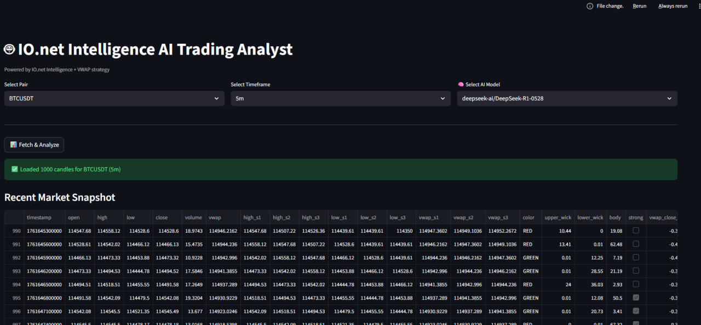
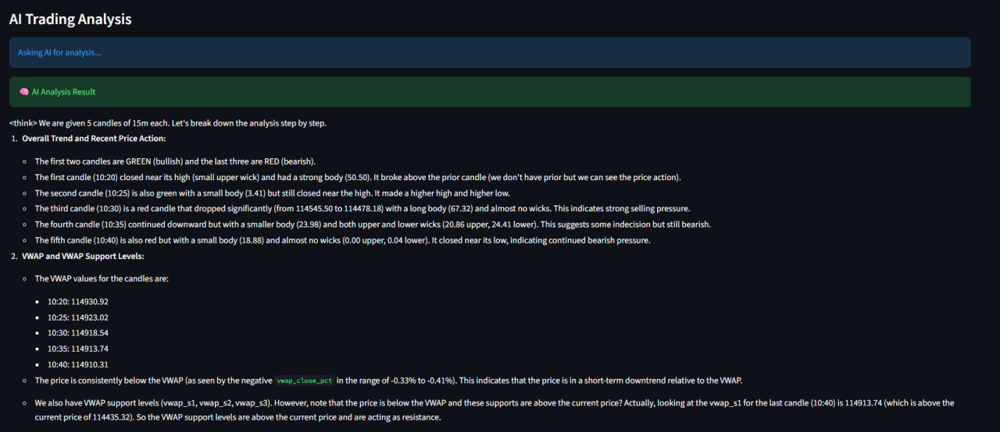
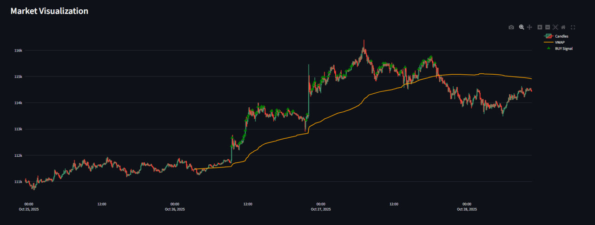

```markdown
# 🤖 AI Crypto Trading Dashboard (Powered by IO.net Intelligence)

A real-time crypto market analytics dashboard that combines:
- **Live OHLCV data from Binance**
- **VWAP-based technical signal detection**
- **Multi-model LLM analysis from IO.net Intelligence**
- **Interactive trading visualization with Streamlit + Plotly**

This dashboard helps traders quickly evaluate market trends, identify potential entry signals, and receive AI-driven trade commentary in real time.

---

## 🚀 Features

| Feature | Description |
|--------|-------------|
| 📈 Live Candlestick Chart | Visualize real-time market movement using Plotly |
| 🎯 VWAP Buy Signal Detection | Identifies potential long entries using candle structure + VWAP alignment |
| 🧠 Multi-Model AI Analysis | Choose from 16+ advanced reasoning models hosted on IO.net Intelligence |
| 🔄 Works With Any Pair | BTC, ETH, IO, BNB and more |
| 🧩 Clean Streamlit UI | Simple, fast, mobile-ready dashboard |
| 🔐 API Keys Stay Local | Your API keys remain securely in `.env` |

---

## 🧠 AI Model Support

Supports any model available in your **IO.net Intelligence account**, including:

```

deepseek-ai/DeepSeek-R1-0528
meta-llama/Llama-4-Maverick-17B-128E-Instruct-FP8
Qwen/Qwen3-Next-80B-A3B-Instruct
mistralai/Mistral-Large-Instruct-2411
LLM360/K2-Think
... and more

````

Add or remove models in `models.txt`.

---
## 📸 Screenshots

### Dashboard Overview


### AI Trading Analysis Panel


### Candlestick + VWAP Buy Signal Chart


## 📦 Installation

### 1️⃣ Clone this repository
```bash
git clone https://github.com/YOUR_USERNAME/ai-trading-dashboard.git
cd ai-trading-dashboard
````

### 2️⃣ Install dependencies

```bash
pip install -r requirements.txt
```

### 3️⃣ Configure your `.env`

Create `.env` file:

```
IOINTELLIGENCE_API_KEY=your_io_intelligence_key_here
```

> **Do not share or commit your `.env` file.**

### 4️⃣ Run the dashboard

```bash
streamlit run app.py
```

Open in browser:

```
http://localhost:8501
```

---

## 📡 How It Works

```
Binance → OHLCV Data → VWAP + Candle Strength
                          ↓
                 AI Prompt Generator
                          ↓
           IO.net Intelligence Model
                          ↓
             Trading Insight & Signals
```

---

## 🎯 Strategy (Buy Signal Logic)

A BUY signal triggers when:

* Price closes **above VWAP**
* Candle is **bullish and stronger than previous highs**
* VWAP deviation is **between +0.25% and +1.50%**

This approach attempts to catch **momentum-based trend continuation** entries.

---

## 🏗️ Project Structure

```
├── app.py                 # Streamlit UI dashboard
├── candle.py              # Market data + VWAP + signal logic
├── io_net_client.py       # IO.net Intelligence API wrapper
├── models.txt             # Available LLM model list
├── requirements.txt
└── .env                   # Local API key config (not committed)
```

---

## 🌍 Join the IO.net Community

Connect with builders, traders, GPU node operators, and researchers:

| Platform           | Link                                                                                 |
| ------------------ | ------------------------------------------------------------------------------------ |
| 💬 **Discord**     | [https://discord.com/invite/ionetofficial](https://discord.com/invite/ionetofficial) |
| 🐦 **Twitter / X** | [https://twitter.com/ionet](https://twitter.com/ionet)                               |
| 🌍 **Telegram**    | [http://t.me/io_net](http://t.me/io_net)                                             |

We share dashboards, model experiments, trading results, and GPU compute tips.
Come build the future of decentralized AI with us 🚀

---

### ⭐ Support the Project

If this project helps you — show some love:

* ⭐ Star the GitHub repo
* 🗣 Share your dashboard screenshots with the community
* 🔧 Open PRs to improve the strategy or add indicators

---
Built by Saad ❤️ for the IO Community 💛


```

